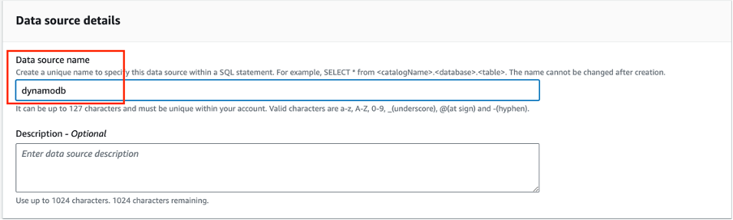
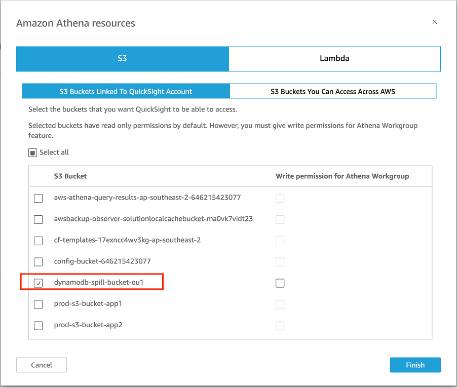

# Monitoring restore and migration progress at scale 

The Amazon S3 Glacier storage classes are purpose-built for data archiving, providing you with the highest performance and retrieval flexibility, as well as the lowest cost archive storage in the cloud.

With introduction of new S3 storage classes such as Glacier Instant Retrieval, customers now have the option to store objects with low storage cost and access to the objects within milliseconds. However, there are also use cases where the archived data stored in Glacier Flexible Retrieval or Glacier Deep Archive need to be actively accessed again and thus need to be migrated to different storage classes. To migrate existing objects in Glacier Flexible Retrieval and Glacier Deep Archive to Glacier Instant Retrieval or any other storage classes, a two-phase process is required involving 1) initiating the restoration of the archived objects, and 2) copying the restored objects to a new storage class.

Batch operation is designed to restore objects stored in Glacier Flexible Retrieval and Glacier Deep Archive at scale, which then can also be used to migrate the objects to a new storage class. While batch operation provides job reports for restore jobs, it does not update on the completion of the restore operations. The restore duration varies between a few minutes to 48 hours, depending on the current storage class and retrieval option specified. There are a few options to monitor the status of the objects being restored, namely AWS CLI head-object or AWS Console on an individual object basis, which is impractical when monitoring a large scale restore operation with millions of objects. 

## Solution

Monitoring Glacier restore and copy progress using S3 Event Notification, DynamoDB, Lambda, Athena and QuickSight 

### Architecture Overview

### Solution Components

- S3 Inventory
- S3 Event Notification
- Amazon EventBridge
- Amazon DynamoDB
- AWS Lambda
- Amazon Athena
- Amazon QuickSight

### Solution walk through

1.	Upload a manifest file that contains all the objects in the restoration and/or copy scope to the designated S3 bucket
2.	Leverage Amazon DynamoDB import from S3 to ingest the manifest file to an Amazon DynamoDB table
3.	Leverage Amazon Lambda to update the Amazon DynamoDB table when receives S3 Event Notifications or Amazon EventBridge events for restore initiation, restore completion and copy completion events
4.	Visualise the restore and/or copy progress with Amazon Athena and Amazon QuickSight

### Solution benefit

Provides customer single visualised dashboard to monitor the restore and copy progress within a defined scope. Customers will be able to access these statistics presented with coordinating graphics that provides a visual depiction of the overall restore and copy progress, summarises the status of restore and copy progress in an easily readable manner and captures insights of the objects within the migration scope.

The illustration of restore progress allows customers to trigger the next workflow and the copy progress helps the comprehension of milestones reached from a project perspective.

The restore duration details captured provides insights of restore performance for different retrieval tiers, which can be referenced for planning similar migrations projects.

The duration of the objects being in the temporary storage area provides an indication from storage cost perspective.

 
### Solution Dashboard Samples

 ## Instructions for Deployment

### Prerequisites

1.	QuickSight subscription
2.	Athena DynamoDB Connector
3.	A S3 bucket for data that exceeds Lambda function limits
4.	S3 Event Notifications for Restore/Copy operations are currently not part of an existing workload. Otherwise, choose the Amazon EventBridge option

### Limitation
The solution has been tested with all AWS resources in the same account and in same region.

### Deployment
#### 1.	Follow the steps to create a data source in Athena for DynamoDB
 
 https://catalog.us-east-1.prod.workshops.aws/workshops/9981f1a1-abdc-49b5-8387-cb01d238bb78/en-US/40-federatedquery/402-dynamodb-connector

Make note of the data source name and the spill bucket

	 

#### 2.	Configure Security & permissions to allow QuickSight to access the spill bucket and Athena DynamoDB Connector Lambda function
 

#### 3.	Prepare the manifest file for the objects in scope

 
If versioning was enabled after the bucket was created, the version id for the existing objects in S3 Inventory report is empty. Follow the instruction to convert empty version id to null.
https://docs.aws.amazon.com/AmazonS3/latest/userguide/inventory-configure-bops.html

#### 4.	Deploy the CloudFormation template

#### 5.	Launch S3 Batch Operation job with the same manifest file

### Cost Estimate

